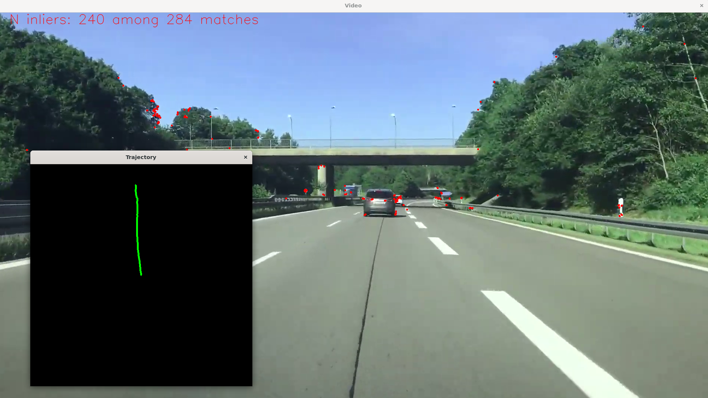

# Description
Simplified visual odometry for uncalibrated camera path estimation in C++ using OpenCV.

Pipeline consists of:
- Keypoint extraction using ORB
- Matching keypoints between each pair of consecutive frames
- Filtering matches using:
    - Descriptor distance ratio test (Lowe's ratio)
    - RANSAC inlier filtering based on epipolar geometry
- Estimating the essential matrix from matched keypoints
- Recovering relative camera pose (rotation and translation direction) from the essential matrix

# How to run

#### Opencv installation
```bash
sudo apt install libopencv-dev
```

#### Set path to video
Path should be set via `INPUT_VIDEO_PATH` constexpr in `main.cpp`.

#### Build and run
```bash
make           # Builds the project
./main         # Runs the executable
```

#### Clean
```bash
make clean     # Cleans up build files
```

# Example  


# Credits
[OpenCV](https://opencv.org/) is used for most of image processing